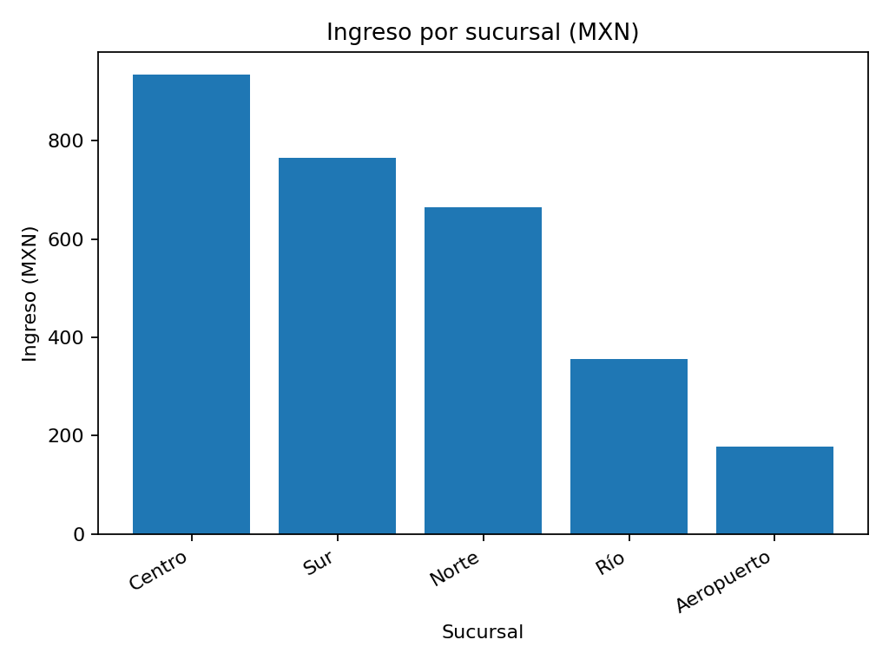
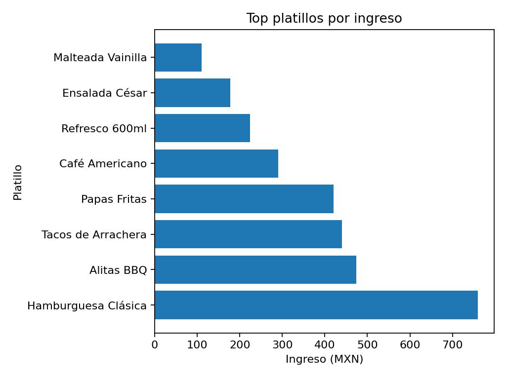
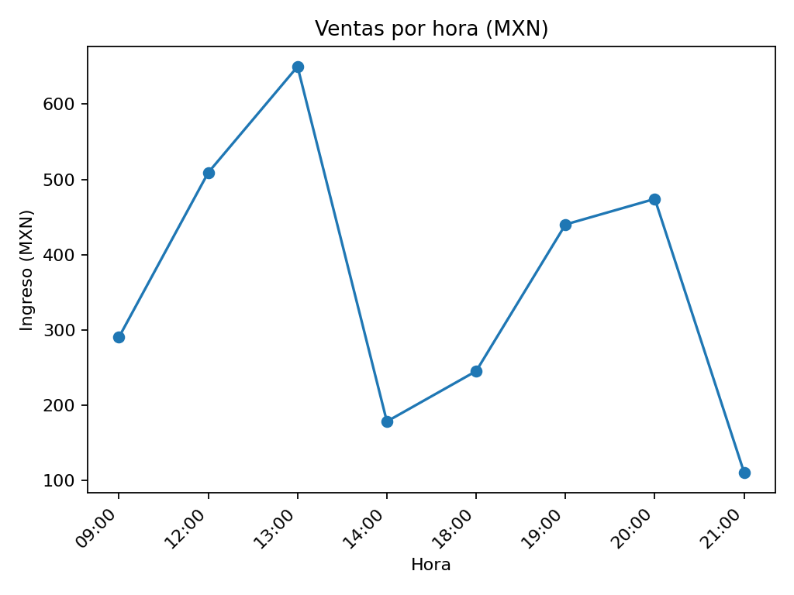

# Proyecto 1 — Dashboard de Ventas y KPIs

> **Resumen ejecutivo**
> - Se integraron datos de ventas de 5 sucursales y se construyó un tablero con KPIs clave.
> - El análisis permite identificar horarios pico, productos estrella y brechas entre sucursales.
> - Los resultados (gráficas y CSV de KPIs) se generan automáticamente al ejecutar el notebook.

---

## 🎯 Objetivo
Analizar ventas históricas y construir un dashboard con indicadores para la toma de decisiones operativas y comerciales.

## 🧪 Datos y metodología
- **Fuente:** `data/ventas_sucursales.csv` (datos ficticios para práctica).
- **Proceso (notebook):** `notebooks/analisis_ventas.ipynb`
  1) Limpieza y transformación (fechas/horas, categorías).  
  2) Cálculo de KPIs (ticket promedio, ingresos por sucursal/hora, top platillos).  
  3) Exportación de resultados a `reports/` (CSVs + imágenes para el reporte y dashboard).

---

## 📊 KPIs principales
- **Ticket promedio (MXN)** = Ingreso total / N.º de tickets *(aprox. con total_mxn y cantidad cuando aplique)*  
- **Ventas por hora y por día** (ingresos agregados por franja y fecha).  
- **Top 10 platillos** por ingreso.  
- **Comparativo por sucursal** (ingresos totales y participación).  
- **Crecimiento vs. periodo anterior** *(si se parametriza rango de fechas)*.

> Las medidas se calculan con **Pandas** y se visualizan con **Matplotlib**. Los CSV quedan listos para usarse en **Excel/Power BI**.

---

## 🧾 Resultados (gráficas)
> Las imágenes se generan al ejecutar el notebook y se guardan en `reports/`.

**Ingreso por sucursal**

**Top platillos por ingreso**

**Ventas por hora**

---

## 📂 Archivos generados
- `reports/ingreso_por_sucursal.csv`  
- `reports/top_platillos.csv`  
- `reports/ventas_por_hora.csv`  
- `reports/chart_ingreso_por_sucursal.png`  
- `reports/chart_top_platillos.png`  
- `reports/chart_ventas_por_hora.png`

> Estos archivos alimentan el **dashboard en Excel/Power BI** (opcional):
> - `reports/dashboard_excel.xlsx`  
> - `reports/dashboard_powerbi.pbix`

---

## 🚀 Cómo reproducir
1. (Opcional) Actualiza o reemplaza `data/ventas_sucursales.csv`.  
2. Abre `notebooks/analisis_ventas.ipynb` y ejecuta todas las celdas.  
3. Revisa `reports/` para ver CSV e imágenes.  
4. (Opcional) Conecta los CSV a tu dashboard de Excel/Power BI.

---

## ✅ Hallazgos tipo (para guía de interpretación)
- **Productos estrella:** identifica los 5 con mayor contribución al ingreso.  
- **Horarios pico:** concentra personal e inventario en las horas de mayor ingreso.  
- **Brecha entre sucursales:** prioriza acciones en las de menor rendimiento (promos, entrenamiento, surtido).  

> **Nota:** Los hallazgos exactos dependen del CSV cargado. Vuelve a ejecutar el notebook cuando cambies la data.

---

## 🛠 Herramientas
Excel/Power Query, Power BI, Python (Pandas/Matplotlib).

---

## 📝 Notas
- Los datos son **ficticios** y se usan con fines educativos.  
- Ajusta columnas/KPIs según tu operación real (por ejemplo, si deseas medir ticket por número real de tickets del POS).

