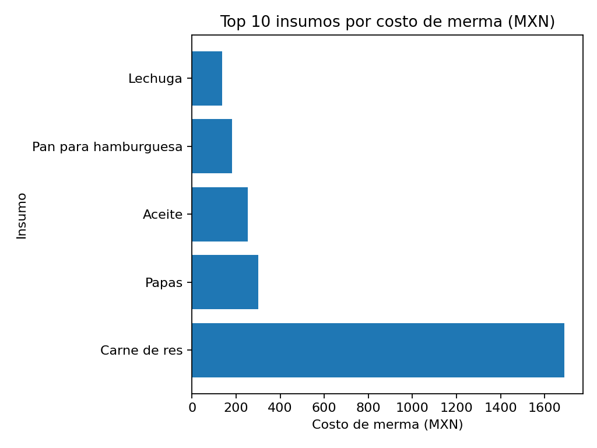
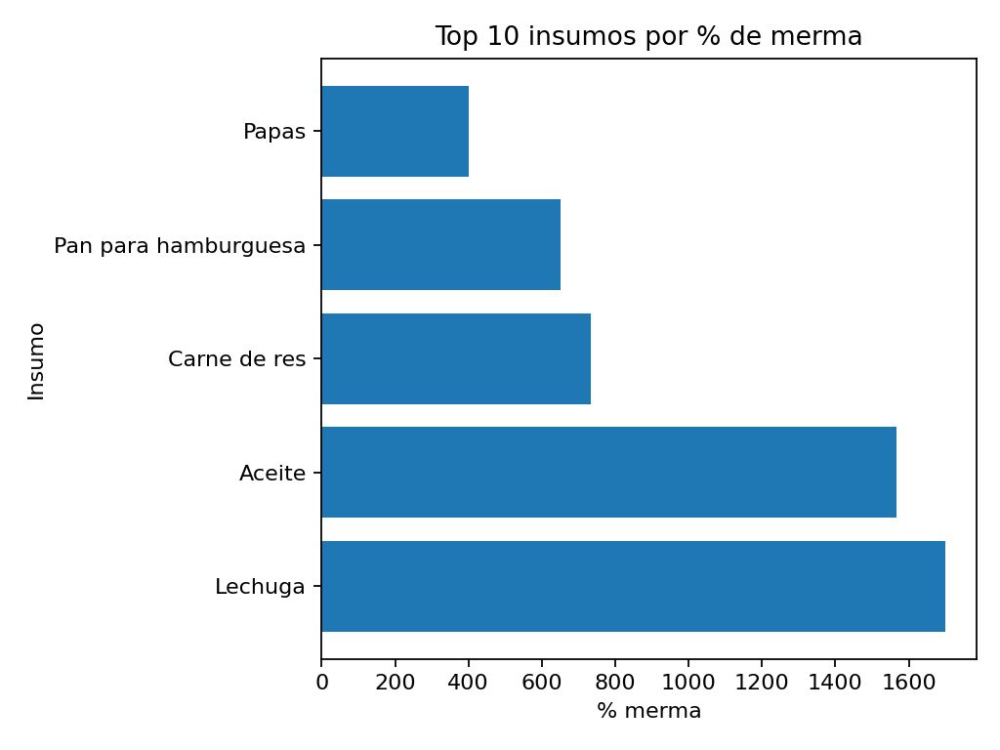

# Proyecto 2 — Control de Inventarios y Merma

> **Resumen ejecutivo**
> - **Costo total de merma:** $2,561 MXN
> - **Mayor costo de merma:** Carne de res ($1,690 MXN)
> - **Mayor % de merma:** Lechuga (1700.0%)
> - **Insumos con merma positiva:** 5
> - **Ahorro potencial (–20% merma):** $512 MXN

**Acciones prioritarias:** atacar Carne de res para ahorro inmediato; estandarizar proceso en Lechuga (rotación, manejo y controles).

---

## 🎯 Objetivo
Cuantificar merma (pérdida) y optimizar insumos relacionando compras, consumos y ventas.  
Priorizar acciones por **impacto en $** (costo) y por **disciplina operativa** (%).

---

## 🧪 Datos y metodología
- **Fuentes**
  - `data/inventario_movimientos.csv` → entradas/salidas/costo unitario por insumo.
  - `data/recetas.csv` → insumo, unidad y cantidad por platillo.
  - `../proyecto-1-dashboard-ventas/data/ventas_sucursales.csv` → unidades vendidas por platillo.
- **Notebook**: `notebooks/analisis_inventario.ipynb`
- **Cálculos**
  - **Consumo Teórico** = `cantidad_por_platillo × unidades_vendidas`.
  - **Consumo Real** = `sum(salida)` desde inventario.
  - **Merma (unid.)** = `Consumo Real − Consumo Teórico`.
  - **Merma %** = `Merma / Consumo Teórico`.
  - **Costo de merma (MXN)** = `Merma (unid.) × costo_unitario_promedio`.

> Se normalizan columnas (p. ej., `str.strip()`), se agrupa por **insumo + unidad** y se exportan resultados a `reports/`.

---

## 🧾 Resultados (gráficas)
> Las figuras se generan al ejecutar el notebook y se guardan en `reports/`.

**Top 10 insumos por costo de merma (MXN)**

**Top 10 insumos por % de merma**

*Interpretación tipo:*  
- **Costo**: señala dónde se va el dinero (priorizar ahorro → p. ej., Carne de res).  
- **%**: revela problemas de proceso (mejorar manejo/rotación → p. ej., Lechuga/Aceite).

---

## 📂 Archivos generados
- `reports/merma_por_insumo.csv`  
- `reports/consumo_teorico_por_insumo.csv`  
- `reports/ventas_por_platillo.csv`  
- `reports/chart_top_costo_merma.png`  
- `reports/chart_top_pct_merma.png`

---

## ✅ Recomendaciones operativas
- **Carne (ahorro inmediato):** pesaje de porciones, revisión de gramajes, control de temperatura/rendimiento.  
- **Lechuga/Aceite (proceso):** FIFO y vida útil, escurrido/almacenamiento, filtrado/cambio por horas.  
- **Tablero diario:** Merma **$** y **%** por sucursal/turno con metas y semáforos.

---

## 🛠 Herramientas
Excel (Tablas dinámicas, Power Query), Power BI, Python (Pandas/Matplotlib).

---

## 📝 Notas
- Datos **ficticios** para fines educativos.  
- Si los costos varían por lote, considerar **costo promedio ponderado** por entradas de inventario.  
- Para análisis por sucursal/periodo, filtrar ventas e inventario antes del cálculo.
